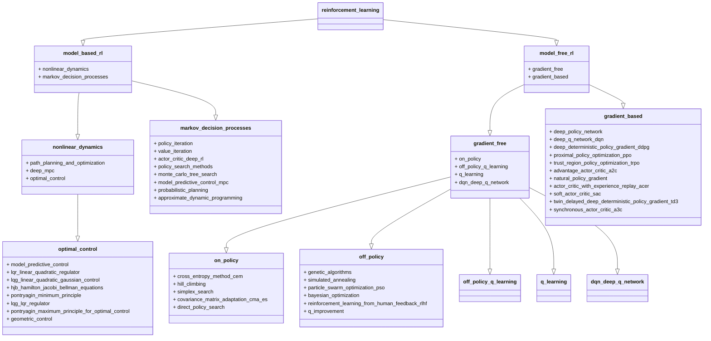
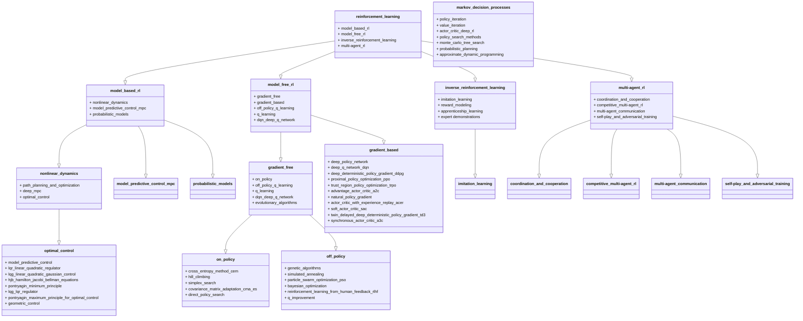

```mermaid
classDiagram


class model_based_rl {
  + nonlinear_dynamics
  + markov_decision_processes
}

class nonlinear_dynamics {
  + path_planning_and_optimization
  + deep_mpc
  + optimal_control
}

class optimal_control {
  + model_predictive_control
  + lqr_linear_quadratic_regulator
  + lqg_linear_quadratic_gaussian_control
  + hjb_hamilton_jacobi_bellman_equations
  + pontryagin_minimum_principle
  + lqg_lqr_regulator
  + pontryagin_maximum_principle_for_optimal_control
  + geometric_control
}

class markov_decision_processes {
  + policy_iteration
  + value_iteration
  + actor_critic_deep_rl
  + policy_search_methods
  + monte_carlo_tree_search
  + model_predictive_control_mpc
  + probabilistic_planning
  + approximate_dynamic_programming
}

class model_free_rl {
  + gradient_free
  + gradient_based
}

class gradient_free {
  + on_policy
  + off_policy_q_learning
  + q_learning
  + dqn_deep_q_network
}

class on_policy {
  + cross_entropy_method_cem
  + hill_climbing
  + simplex_search
  + covariance_matrix_adaptation_cma_es
  + direct_policy_search
}

class off_policy {
  + genetic_algorithms
  + simulated_annealing
  + particle_swarm_optimization_pso
  + bayesian_optimization
  + reinforcement_learning_from_human_feedback_rlhf
  + q_improvement
}

class gradient_based {
  + deep_policy_network
  + deep_q_network_dqn
  + deep_deterministic_policy_gradient_ddpg
  + proximal_policy_optimization_ppo
  + trust_region_policy_optimization_trpo
  + advantage_actor_critic_a2c
  + natural_policy_gradient
  + actor_critic_with_experience_replay_acer
  + soft_actor_critic_sac
  + twin_delayed_deep_deterministic_policy_gradient_td3
  + synchronous_actor_critic_a3c
}

reinforcement_learning --|> model_based_rl
reinforcement_learning --|> model_free_rl
model_based_rl --|> nonlinear_dynamics
nonlinear_dynamics --|> optimal_control
model_based_rl --|> markov_decision_processes

model_free_rl --|> gradient_free
gradient_free --|> on_policy
gradient_free --|> off_policy
gradient_free --|> off_policy_q_learning
gradient_free --|> q_learning
gradient_free --|> dqn_deep_q_network
model_free_rl --|> gradient_based

```

``` mermaid
classDiagram

class reinforcement_learning {
  + model_based_rl
  + model_free_rl
  + inverse_reinforcement_learning
  + multi-agent_rl
}

class model_based_rl {
  + nonlinear_dynamics
  + model_predictive_control_mpc
  + probabilistic_models
}

class nonlinear_dynamics {
  + path_planning_and_optimization
  + deep_mpc
  + optimal_control
}

class optimal_control {
  + model_predictive_control
  + lqr_linear_quadratic_regulator
  + lqg_linear_quadratic_gaussian_control
  + hjb_hamilton_jacobi_bellman_equations
  + pontryagin_minimum_principle
  + lqg_lqr_regulator
  + pontryagin_maximum_principle_for_optimal_control
  + geometric_control
}

class markov_decision_processes {
  + policy_iteration
  + value_iteration
  + actor_critic_deep_rl
  + policy_search_methods
  + monte_carlo_tree_search
  + probabilistic_planning
  + approximate_dynamic_programming
}

class model_free_rl {
  + gradient_free
  + gradient_based
  + off_policy_q_learning
  + q_learning
  + dqn_deep_q_network
}

class gradient_free {
  + on_policy
  + off_policy_q_learning
  + q_learning
  + dqn_deep_q_network
  + evolutionary_algorithms
}

class on_policy {
  + cross_entropy_method_cem
  + hill_climbing
  + simplex_search
  + covariance_matrix_adaptation_cma_es
  + direct_policy_search
}

class off_policy {
  + genetic_algorithms
  + simulated_annealing
  + particle_swarm_optimization_pso
  + bayesian_optimization
  + reinforcement_learning_from_human_feedback_rlhf
  + q_improvement
}

class gradient_based {
  + deep_policy_network
  + deep_q_network_dqn
  + deep_deterministic_policy_gradient_ddpg
  + proximal_policy_optimization_ppo
  + trust_region_policy_optimization_trpo
  + advantage_actor_critic_a2c
  + natural_policy_gradient
  + actor_critic_with_experience_replay_acer
  + soft_actor_critic_sac
  + twin_delayed_deep_deterministic_policy_gradient_td3
  + synchronous_actor_critic_a3c
}

class inverse_reinforcement_learning {
  + imitation_learning
  + reward_modeling
  + apprenticeship_learning
  + expert demonstrations
}

class multi-agent_rl {
  + coordination_and_cooperation
  + competitive_multi-agent_rl
  + multi-agent_communication
  + self-play_and_adversarial_training
}

reinforcement_learning --|> model_based_rl
reinforcement_learning --|> model_free_rl
reinforcement_learning --|> inverse_reinforcement_learning
reinforcement_learning --|> multi-agent_rl
model_based_rl --|> nonlinear_dynamics
nonlinear_dynamics --|> optimal_control
model_based_rl --|> model_predictive_control_mpc
model_based_rl --|> probabilistic_models
model_free_rl --|> gradient_free
model_free_rl --|> gradient_based
gradient_free --|> on_policy
gradient_free --|> off_policy
inverse_reinforcement_learning --|> imitation_learning
multi-agent_rl --|> coordination_and_cooperation
multi-agent_rl --|> competitive_multi-agent_rl
multi-agent_rl --|> multi-agent_communication
multi-agent_rl --|> self-play_and_adversarial_training

```